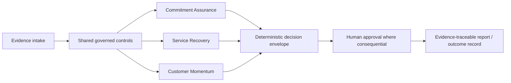

# VANTIX Attestor

**Governed customer-outcome assurance that binds evidence, deterministic controls, bounded AI, human authority, and measured outcomes across commitment assurance, service recovery, and customer momentum.**

> **Portfolio Preview v0.1.2 — synthetic evidence only.** The repository demonstrates governed control patterns with owner-run synthetic n8n executions and a consolidated synthetic adversarial suite. It does not claim production-scale operation, live Salesforce integration for the new Attestor modules, live model-provider execution for those modules, real-customer impact, external certification, or production readiness.

## Architecture at a glance

Deterministic controls own policy-critical routing and validation. AI-style narrative/critique is bounded and validated; it cannot approve itself, bypass policy, or independently authorize consequential action.

## Validated evidence

| Evidence | Result | Evidence |
| --- | --- | --- |
| Commitment Assurance | Owner-run synthetic n8n path completed with **20/20 nodes green** | [`commitment-assurance-green.png`](evidence/screenshots/commitment-assurance-green.png) |
| Service Recovery | Owner-run synthetic n8n path completed with **20/20 nodes green** | [`service-recovery-green.png`](evidence/screenshots/service-recovery-green.png) |
| Customer Momentum | Owner-run synthetic n8n path completed with **24/24 nodes green** | [`customer-momentum-green.png`](evidence/screenshots/customer-momentum-green.png) |
| Consolidated adversarial regression | **18/18 PASSED** across negative paths, AI-security controls and cross-module isolation | [`adversarial-regression-v0.1.html`](evidence/reports/adversarial-regression-v0.1.html) |
| Offline exact-node replay | **5/5 local checks PASS**; explicitly not n8n runtime evidence | [`offline-exact-node-test-results.json`](evidence/offline-exact-node-test-results.json) |

The adversarial suite covers `CA-N01`–`CA-N04`, `SR-N01`–`SR-N04`, `CM-N01`–`CM-N03`, `SEC-01`–`SEC-04`, and `XMOD-01`–`XMOD-03`.

## Real failure found and fixed

The Service Recovery pre-import review identified unsafe assumptions around evidence ordering and incomplete timestamp, approval-binding, AI-reference, contradiction, recurrence, and decision-envelope checks. The corrected v0.2 workflow was then imported and executed on the synthetic path. See [`docs/defect-register.md`](docs/defect-register.md).

## What this does not prove yet

- Production-scale throughput, reliability, availability, or process capability.
- Live Salesforce operation for Service Recovery or Customer Momentum.
- Live model-provider execution for the new Attestor modules.
- Authenticated enterprise-grade human approval infrastructure.
- Real-customer outcome improvement or commercial impact.
- External practitioner certification or third-party audit.
- A recorded 60–90 second portfolio demo; the script exists, recording is pending.

## Lineage

Attestor is a controlled evolution from the separately preserved **VANTIX Control Value** project. Control Value remains its own Project 3 repository; Attestor is Project 4 and extends the governed outcome-assurance pattern into three independently measured modules. See [`docs/RELEASE_LINEAGE.md`](docs/RELEASE_LINEAGE.md).

## Reviewer front door

- **15 seconds:** this README and the evidence table above.
- **60 seconds:** [`docs/PLAIN_LANGUAGE_SUMMARY.md`](docs/PLAIN_LANGUAGE_SUMMARY.md).
- **5 minutes:** [`docs/executive-brief.md`](docs/executive-brief.md) and [`docs/evidence-index.md`](docs/evidence-index.md).
- **Technical review:** [`docs/architecture.md`](docs/architecture.md), [`docs/test-catalogue.md`](docs/test-catalogue.md), [`docs/OWASP_AI_SECURITY_MAPPING.md`](docs/OWASP_AI_SECURITY_MAPPING.md), and [`validation/NEGATIVE_TEST_EVIDENCE.md`](validation/NEGATIVE_TEST_EVIDENCE.md).
- **Governance review:** [`docs/PMI_AI_GOVERNANCE_MAPPING.md`](docs/PMI_AI_GOVERNANCE_MAPPING.md), [`docs/pmp-governance.md`](docs/pmp-governance.md), and [`docs/agile-delivery.md`](docs/agile-delivery.md).
- **Measurement review:** [`docs/six-sigma-measurement.md`](docs/six-sigma-measurement.md).
- **Internal scorecard:** [`docs/quality-scorecard.md`](docs/quality-scorecard.md).
- **Demo:** [`docs/demo-script.md`](docs/demo-script.md) — recording pending.

## Release position

**Portfolio Preview v0.1.2 candidate.** The historical v0.1.1 pre-release synchronized the 18/18 owner-run synthetic adversarial evidence and documentation closure. v0.1.2 adds repository-completeness controls, OWASP/PMI mappings, exact-node offline replay, repository/validator negative-test evidence, graph validation, secret scanning, and a complete checksum ledger. The exact GitHub Actions run for the final merged commit must pass before v0.1.2 is called CI Green or frozen.

See [`UPLOAD_READY.md`](UPLOAD_READY.md) before merging.
